<p align="center">
  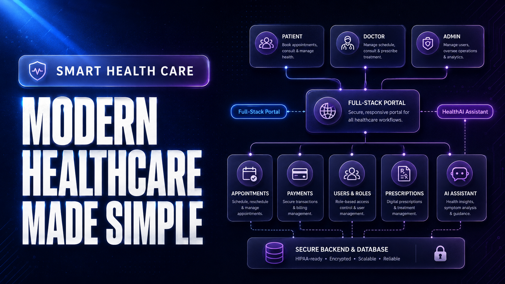
</p>

<p align="center">
  
  
  
  
  
  
</p>

<p align="center">
  
  
  
  
  
  
  
</p>

<p align="center">
  
  
  
  
  
  
  
</p>

<p align="center">
  
  
  
  


</p>

<h1 align="center">Smart Health Care — Modern Healthcare Made Simple</h1>

**Full-stack healthcare portal** for doctor discovery, appointment booking, Stripe payments, prescriptions, and role-based dashboards — with an AI health assistant.

[**Live Demo**](https://smarthealthcare-start.netlify.app/) · [Repository](https://github.com/mohamim360/SmartHealthCare-Hospital-Management-System)

---

## The problem & the solution

Healthcare booking and practice management often live in disconnected tools — one site to find a doctor, another to pay, another for admin staff.

**Smart Health Care** brings it together: public discovery and marketing, patient booking with **Stripe Checkout**, doctor scheduling with weekly availability, admin operations for the whole practice, and **HealthAI** for guided navigation and appointment help — all on one platform built with modern full-stack TypeScript.

> Find qualified doctors, let AI book appointments for you or your staff, and manage health records from one trusted platform.

---

## Key features

### Public experience

<p align="center">
  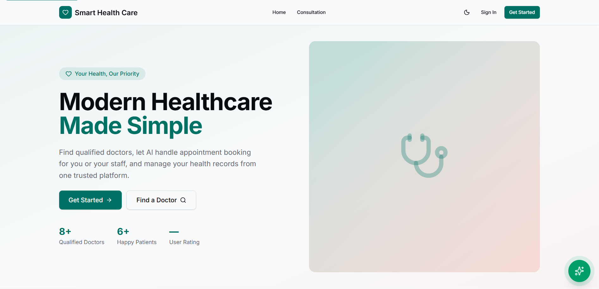
  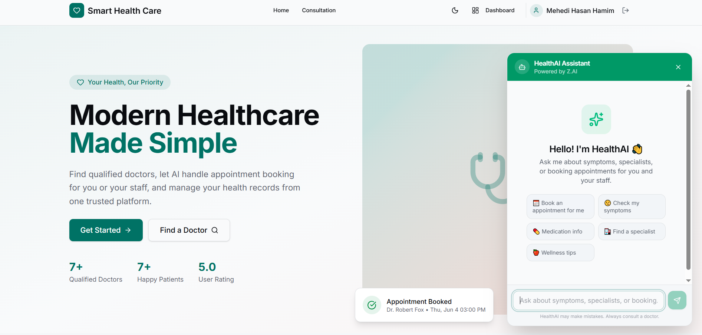
  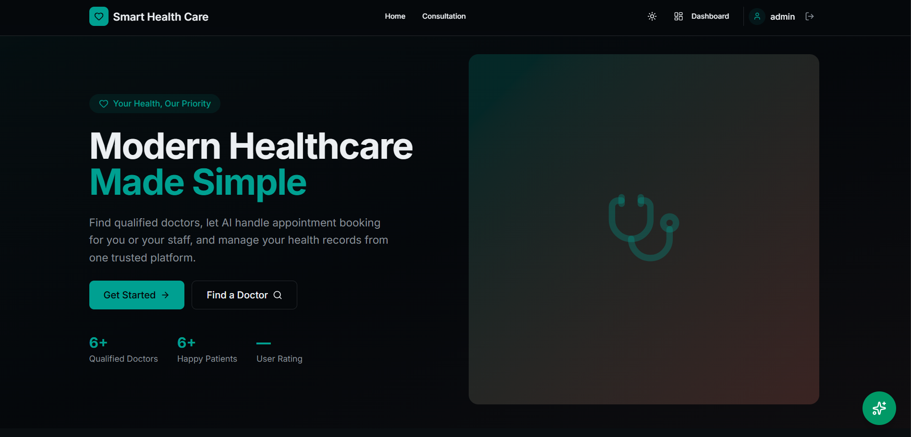
</p>

**Marketing landing (`/`)**  
Hero section, live platform statistics, featured doctors carousel, patient testimonials, and calls-to-action for consultation and registration. Logged-in patients can see their next upcoming appointment. **HealthAI** chat widget is available on the landing page for guided help.

<p align="center">
  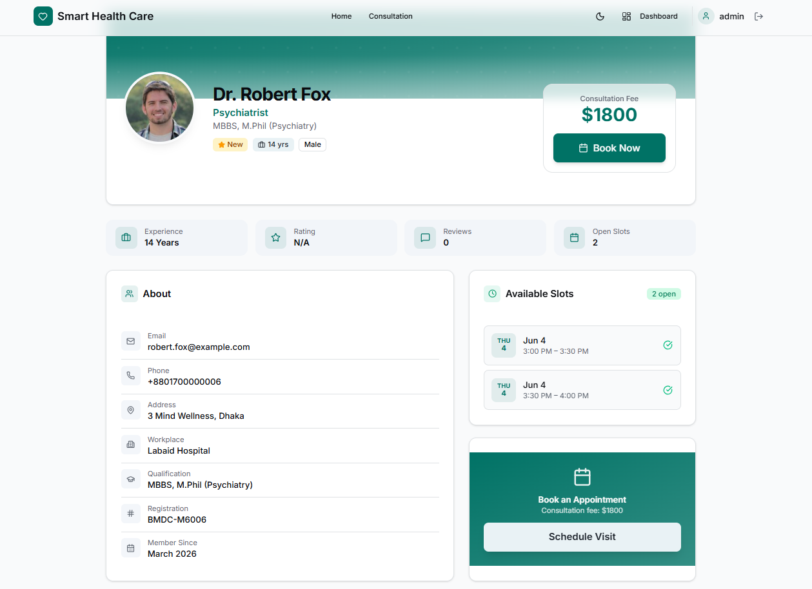
  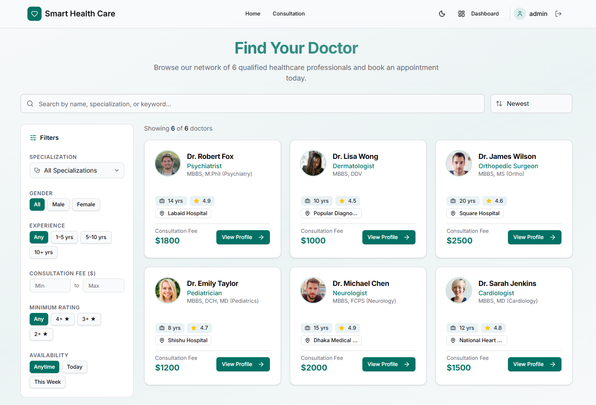
</p>

**Doctor directory (`/consultation`)**  
Browse all active doctors with search, designation/specialization filters, and pagination. Responsive grid layout with doctor cards showing photo, experience, average rating, and consultation fee. Filter sidebar for refining results on larger screens.

**Public doctor profiles (`/doctor/:id`)**  
Detailed doctor page with profile photo, designation, experience, ratings, and available time slots pulled from real schedule data. Helps patients evaluate a doctor before signing in to book.

<p align="center">
  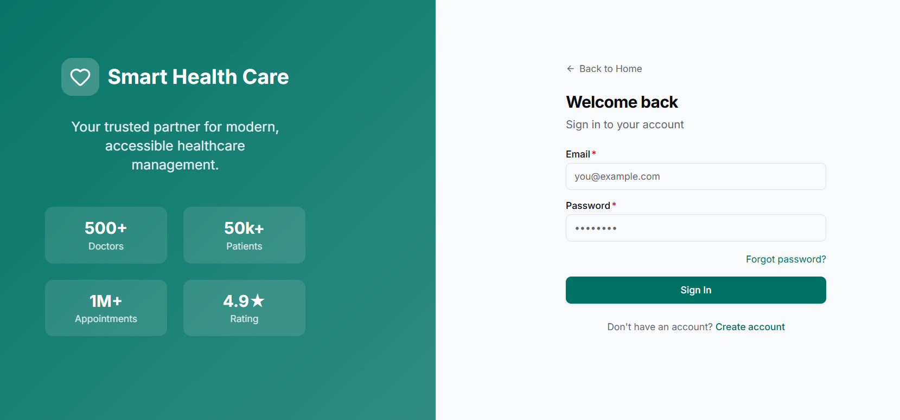
  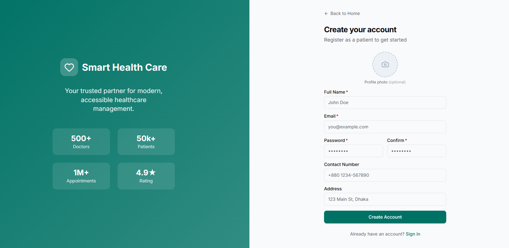
</p>

**Authentication**

- **Login** (`/login`) — email/password with JWT session (HttpOnly cookies + optional Bearer token)
- **Register** (`/register`) — patient onboarding with optional **Cloudinary** profile photo upload
- Role-based redirect after login: Patient, Doctor, or Admin dashboard

---

### Patient dashboard

<p align="center">
  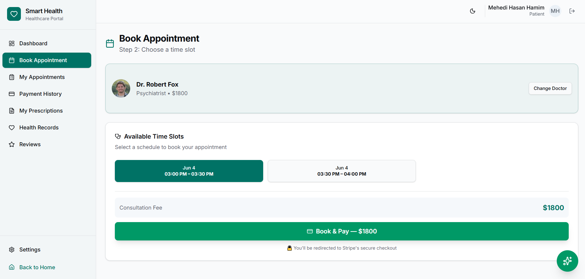
  
  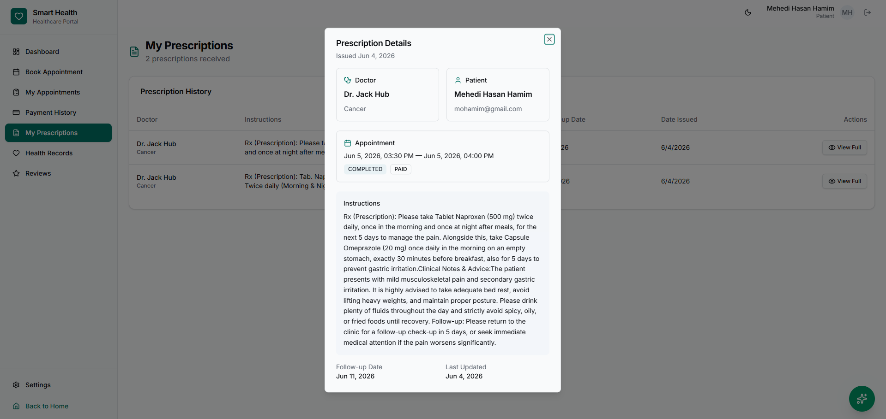
</p>
<p align="center">
  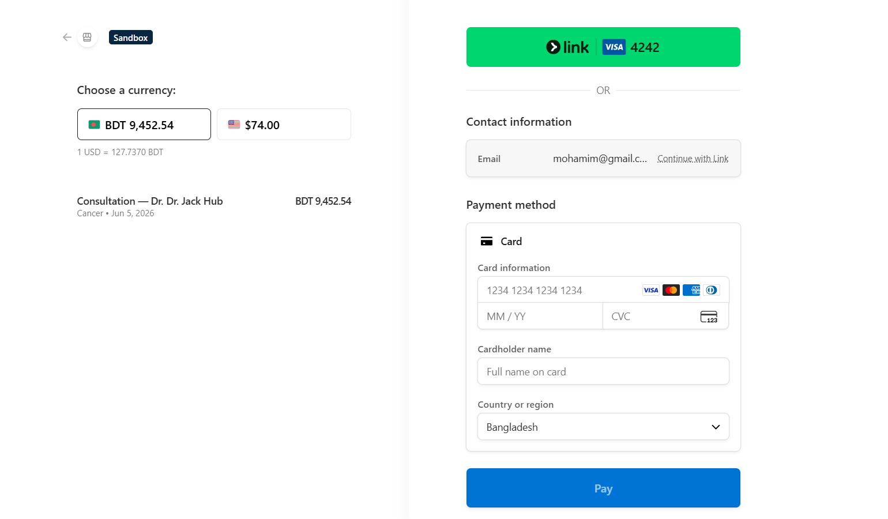
  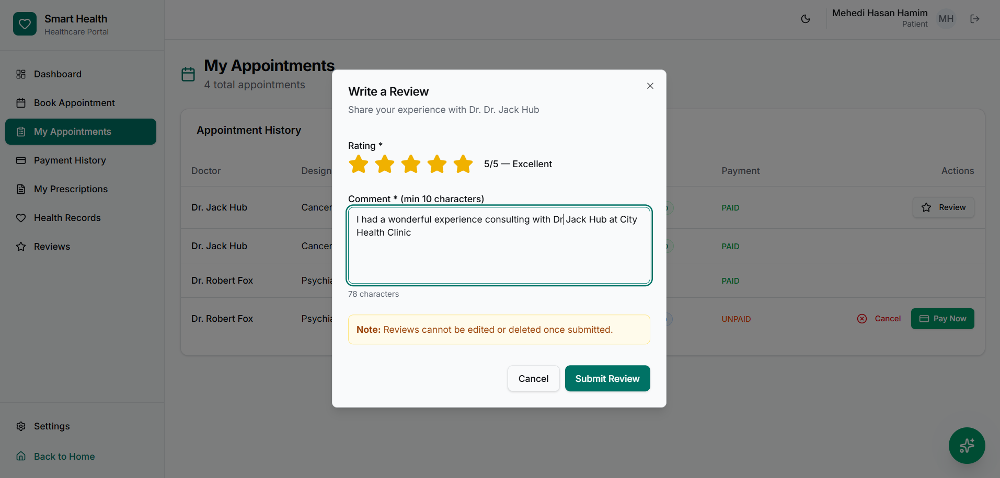
  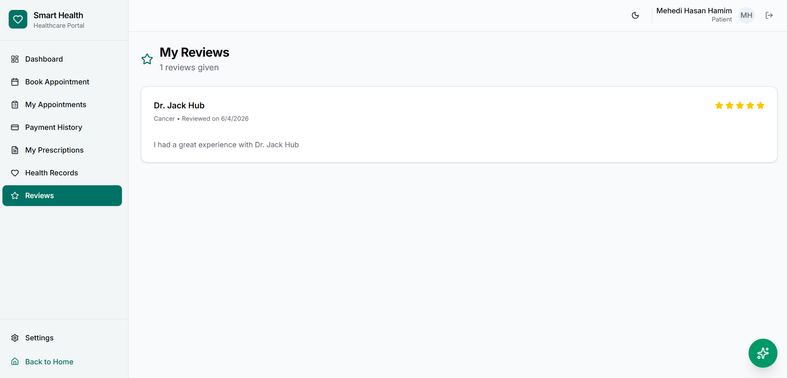
</p>

**Overview (`/dashboard/patient`)**  
Personal dashboard with upcoming appointments, quick stats, and navigation to booking, payments, prescriptions, and reviews.

**Book appointment (`/dashboard/patient/book-appointment`)**  
Two-step booking flow:

1. Choose a doctor from the directory-style grid
2. Pick an available future time slot

Two payment options at checkout:

- **Book Now — Pay Later** — reserves the slot immediately; payment can be completed later from My Appointments
- **Book & Pay** — books the slot and redirects to **Stripe Checkout** for immediate payment

Slot booking uses atomic database transactions to prevent double-booking and respects doctor day cancellations.

**My appointments (`/dashboard/patient/my-appointments`)**  
Paginated list of all appointments with doctor name, schedule, status (`SCHEDULED`, `INPROGRESS`, `COMPLETED`, `CANCEL`), and payment status (`UNPAID`, `PAID`, `REFUNDED`). Actions include:

- **Cancel** — for scheduled visits; **automatic Stripe refund** if already paid
- **Pay Now** — Stripe Checkout for unpaid, non-cancelled appointments
- **Leave a review** — after completed visits (rating + comment)

**Payment history (`/dashboard/patient/payment-history`)**  
Track every payment linked to appointments, with status filters and **Pay Now** for outstanding balances.

**Payment success / cancel (`/dashboard/patient/payment-success`, `payment-cancel`)**  
Post-checkout pages with session verification (webhook fallback) and clear next steps.

**My prescriptions (`/dashboard/patient/my-prescriptions`)**  
View prescription history with doctor details, follow-up dates, and **View Full** dialog showing complete instructions, appointment context, and metadata.

**Health records (`/dashboard/patient/health-records`)**  
Card-based view of the same prescription data optimized for reading full medical notes at a glance.

**Reviews (`/dashboard/patient/reviews`)**  
Submit and manage doctor reviews tied to completed appointments.

**Settings (`/dashboard/settings`)**  
Profile management and logout (shared across roles).

---

### Doctor dashboard

<p align="center">
  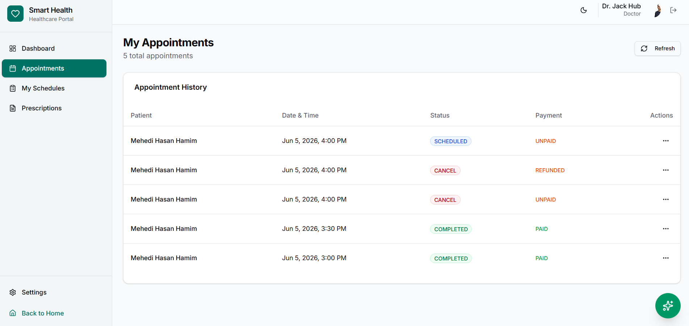
  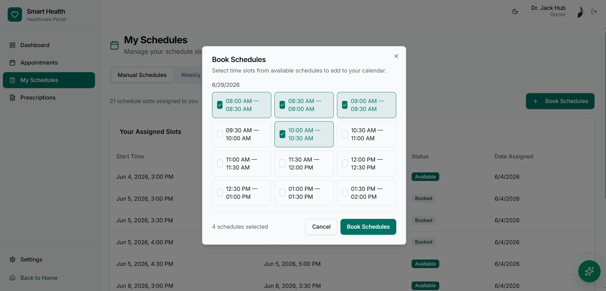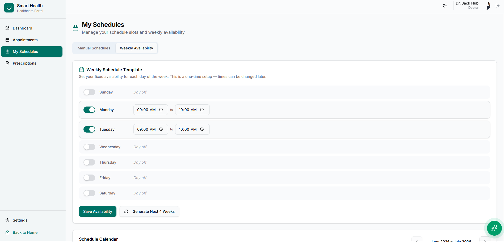
  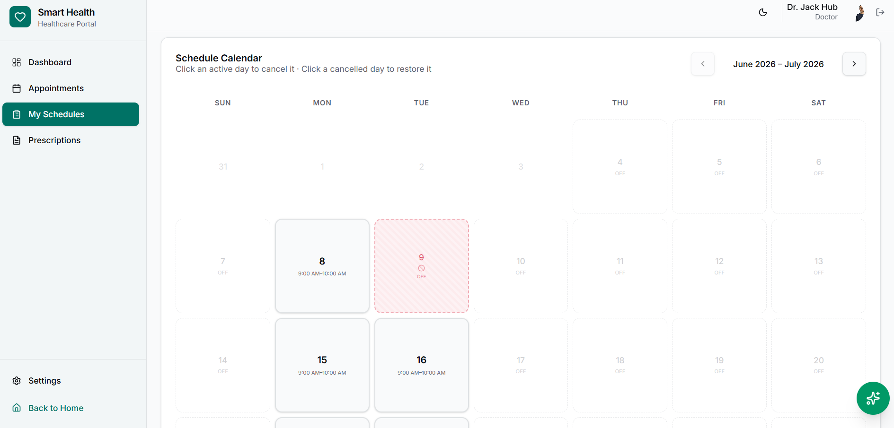
  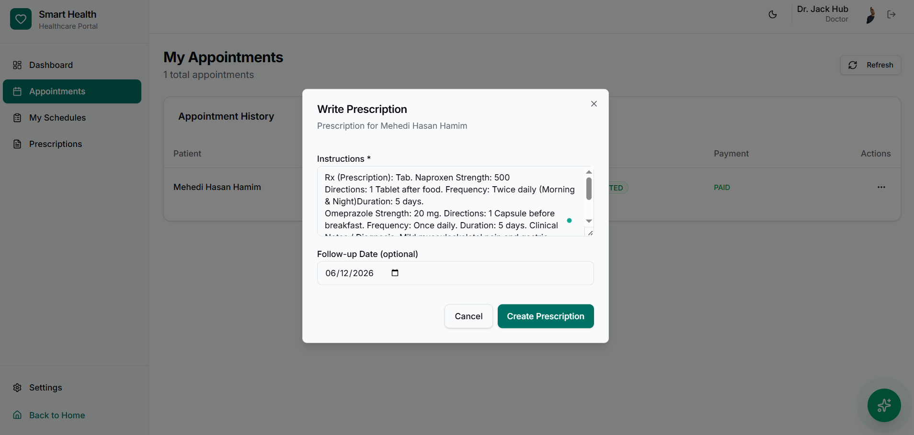
  </p>

**Overview (`/dashboard/doctor`)**  
Snapshot of today’s workload: appointment counts, prescriptions, and ratings.

**Appointments (`/dashboard/doctor/appointments`)**  
Manage all patient visits for the logged-in doctor. Update appointment status through the lifecycle (`SCHEDULED` → `INPROGRESS` → `COMPLETED` or `CANCEL`). **Write Prescription** dialog for completed, paid visits — one prescription per appointment.

**My schedules (`/dashboard/doctor/my-schedules`)**  
Advanced scheduling toolkit:

- **Weekly availability template** — recurring hours per day of week
- **Generate slots** — materialize bookable `Schedule` rows from the template
- **Day cancellation** — block a date and auto-cancel existing scheduled appointments on that day (with refunds when paid)
- View booked vs available slots on a calendar-oriented UI

**Prescriptions (`/dashboard/doctor/prescriptions`)**  
List all prescriptions issued by the doctor. **View** opens full detail (patient, instructions, follow-up, appointment date). **Edit** allows updating instructions and follow-up date after issuance.

---

### Admin dashboard

<p align="center">
  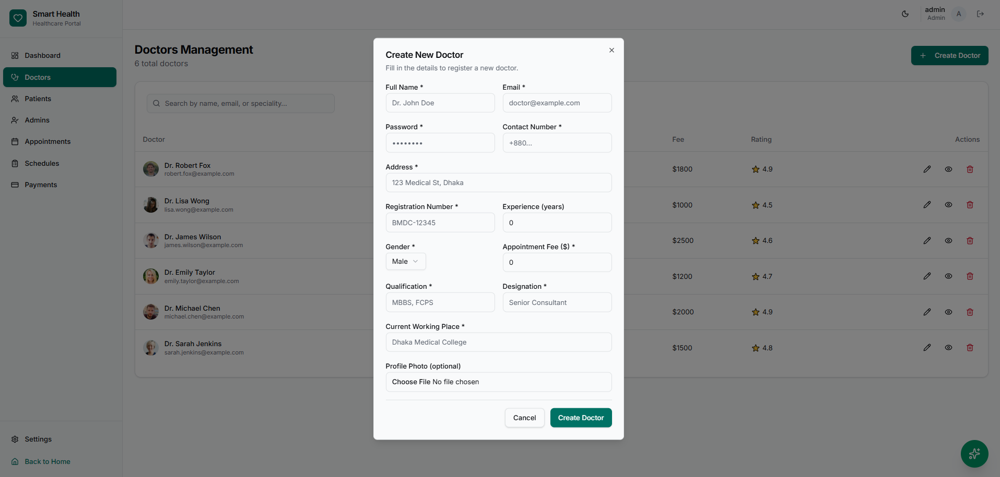
  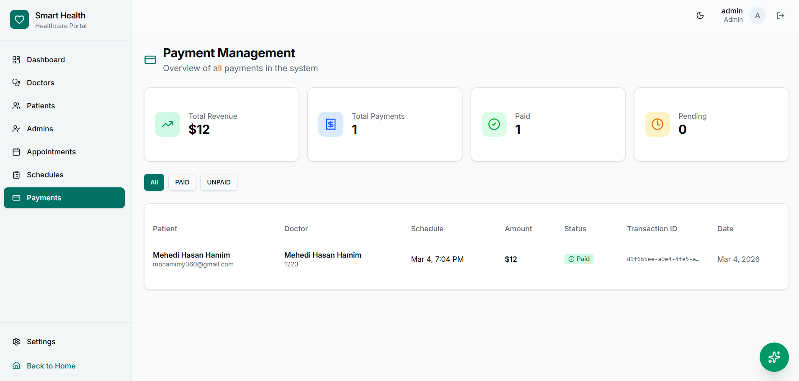
  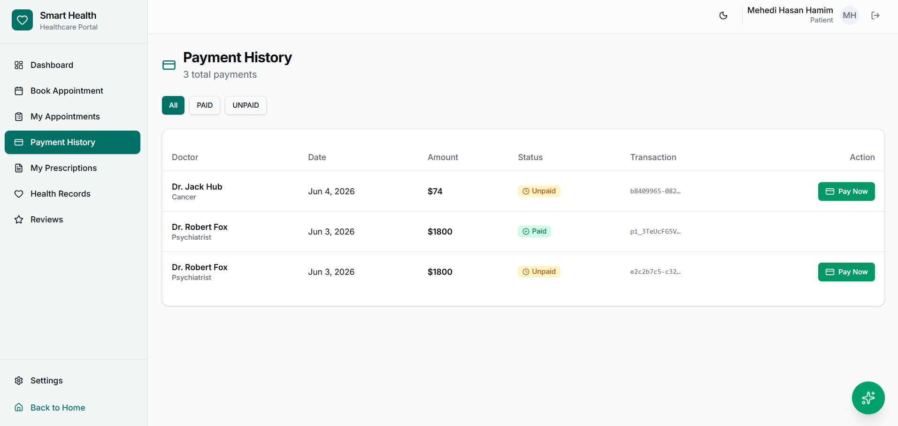
  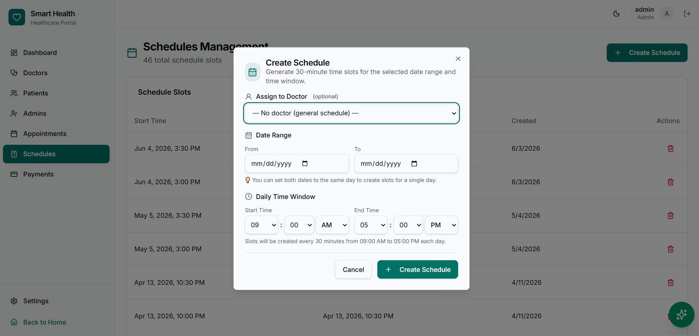
  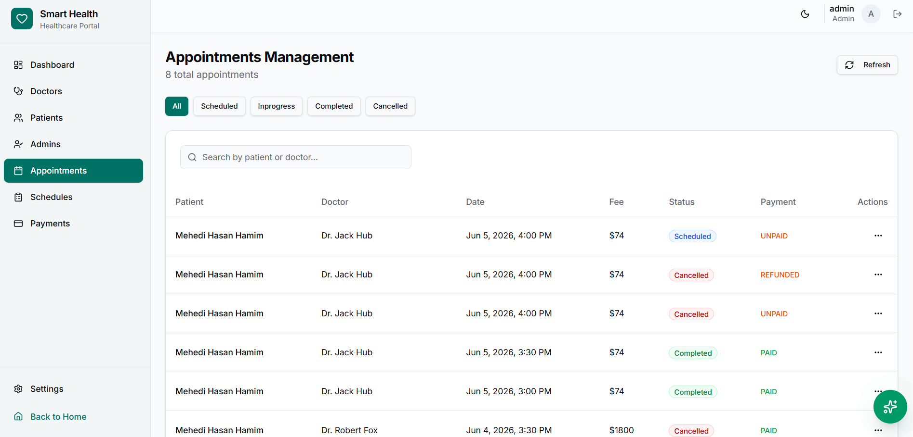
</p>

**Overview (`/dashboard/admin`)**  
Practice-wide KPIs: users, appointments, revenue-oriented payment stats, and activity summaries.

**Doctors management (`/dashboard/admin/doctors-management`)**  
Create, search, edit, and soft-delete doctors. Assign designation, fees, experience, and profile photos.

**Patients management (`/dashboard/admin/patients-management`)**  
Search, edit contact details, and soft-delete patient records.

**Admins management (`/dashboard/admin/admins-management`)**  
Manage administrative staff accounts (bootstrap first admin via `ALLOW_BOOTSTRAP`).

**Appointments management (`/dashboard/admin/appointments-management`)**  
Full visibility into every appointment with status filters and ability to change status on behalf of the practice (including cancellation with refund when applicable).

**Schedules management (`/dashboard/admin/schedules-management`)**  
Create and manage global schedule windows and link them to doctors.

**Payments (`/dashboard/admin/payments`)**  
Revenue overview, paid vs unpaid counts, and transaction listing across the platform.

**Specialities management (`/dashboard/admin/specialities-management`)**  
UI for managing specialization categories (demo/mock data layer).

---

### HealthAI assistant
<p align="center">
 
  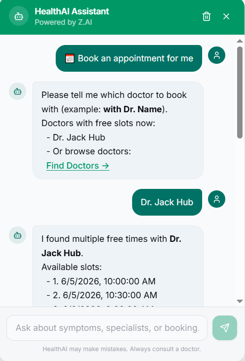
  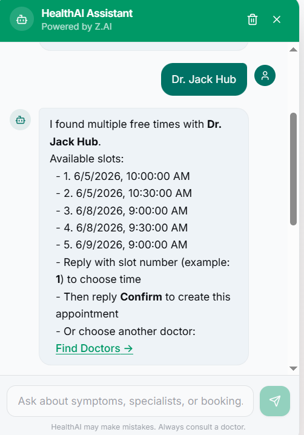
  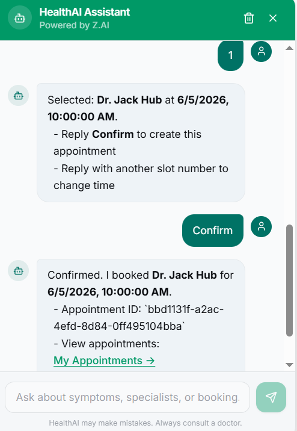
</p>

**Floating chat widget** on the public landing page and inside the authenticated dashboard shell.

**Capabilities:**

- General health information and navigation help (not a replacement for professional medical advice)
- **Role-aware responses** — suggests correct dashboard links for Patient, Doctor, or Admin
- **Safe internal links only** — allowlisted routes to prevent open redirects
- **Appointment booking via chat** — patients can book; admins can book on behalf of a patient (email required)
- **Rate limiting** on the API to reduce abuse
- Powered by **Z.AI (GLM-4.5)** through an OpenAI-compatible API

---

### Payments & refunds

**Stripe integration end-to-end:**

- Checkout Sessions with appointment metadata
- Webhook handler for `checkout.session.completed`
- Success-page **verify** endpoint as a reliable fallback
- Payment records stored with gateway JSON and Stripe payment intent IDs

**Payment statuses:** `UNPAID` (default at booking) → `PAID` (after Stripe) → `REFUNDED` (after cancellation of a paid visit)

**Refund policy (automated):** When a paid appointment is cancelled by patient, doctor, admin, or bulk doctor day-cancel, the system issues a **Stripe refund** and updates both `Payment` and `Appointment` to `REFUNDED`.

---

### Prescriptions & health records

- Doctors create prescriptions only for **completed + paid** appointments
- One prescription per appointment (unique constraint)
- Patients see **full prescription detail** in a modal (instructions, doctor, visit date, follow-up)
- Doctors can **view and edit** prescriptions after creation
- REST API: `GET /api/prescription`, `GET/PATCH /api/prescription/:id`, `POST /api/prescription`

---

### Platform capabilities

| Area                | Details                                                                                                                |
| ------------------- | ---------------------------------------------------------------------------------------------------------------------- |
| **Authentication**  | Custom JWT (access + refresh), bcrypt password hashing, HttpOnly cookies, role middleware on every protected API route |
| **Authorization**   | Three roles — `PATIENT`, `DOCTOR`, `ADMIN` — with route-level and service-level checks                                 |
| **Data layer**      | Prisma 7 + PostgreSQL; soft deletes for users; transactional booking and payments                                      |
| **Validation**      | Zod schemas on API inputs; react-hook-form + zodResolver on client forms                                               |
| **UI/UX**           | shadcn/ui components, Tailwind CSS 4, Framer Motion animations, Sonner toasts, dark mode support                       |
| **File uploads**    | Cloudinary for doctor/patient profile images                                                                           |
| **API design**      | REST-style handlers under `src/routes/api/`; consistent `{ success, message, data, meta }` responses                   |
| **Developer tools** | Interactive API playground at `/dev` for testing endpoints during development                                          |
| **Deployment**      | Netlify build pipeline with Prisma migrate + Vite production bundle                                                    |

---

## Tech stack

| Category     | Technologies                                                                                        |
| ------------ | --------------------------------------------------------------------------------------------------- |
| **Frontend** | React 19, TanStack Router / Start / Query, Tailwind CSS 4, shadcn/ui, Lucide, Framer Motion, Sonner |
| **Backend**  | TanStack Start server handlers, TypeScript domain services, Zod, react-hook-form, date-fns          |
| **Database** | PostgreSQL, Prisma 7 (`@prisma/adapter-pg`)                                                         |
| **Auth**     | Custom JWT (jsonwebtoken) + bcryptjs password hashing                                               |
| **Payments** | Stripe Checkout + webhooks                                                                          |
| **Media**    | Cloudinary                                                                                          |
| **AI**       | Z.AI (GLM-4.5) via OpenAI-compatible HTTP API                                                       |
| **Deploy**   | Netlify (`@netlify/vite-plugin-tanstack-start`)                                                     |

> **Note:** Auth uses custom JWT; the assistant uses Z.AI directly.

---

## Architecture

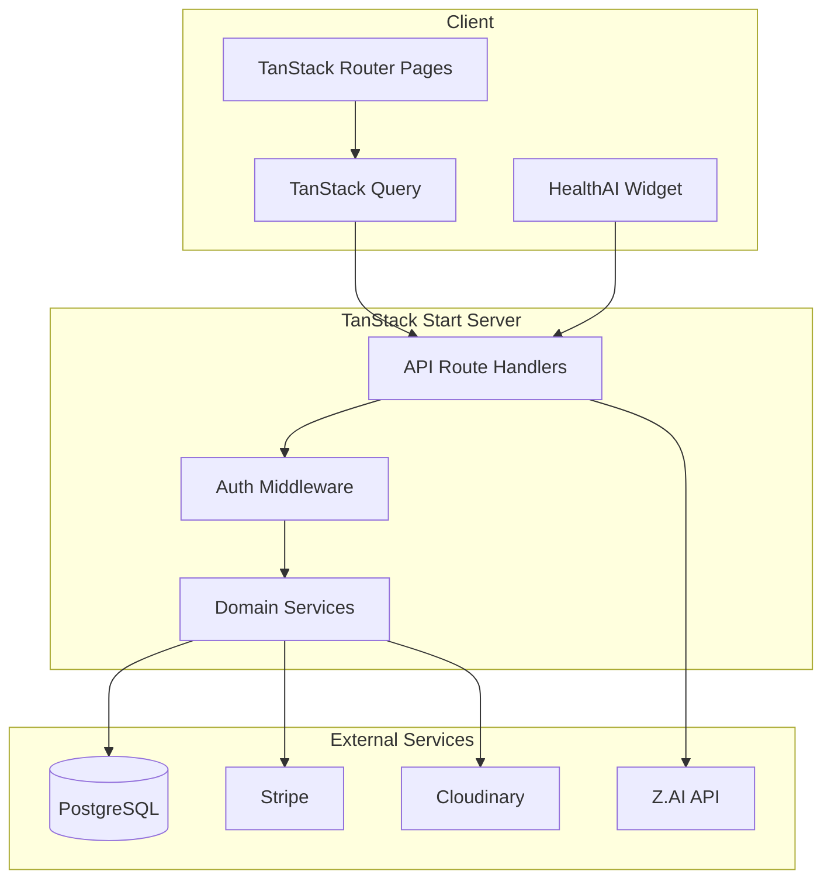
```mermaid
flowchart TB
  subgraph client [Client]
    Pages[TanStack Router Pages]
    Query[TanStack Query]
    Widget[HealthAI Widget]
  end

  subgraph server [TanStack Start Server]
    API[API Route Handlers]
    Services[Domain Services]
    AuthMW[Auth Middleware]
  end

  subgraph external [External Services]
    PG[(PostgreSQL)]
    Stripe[Stripe]
    Cloudinary[Cloudinary]
    ZAI[Z.AI API]
  end

  Pages --> Query
  Query --> API
  Widget --> API
  API --> AuthMW
  AuthMW --> Services
  Services --> PG
  Services --> Stripe
  Services --> Cloudinary
  API --> ZAI
```

**Request flow:** UI pages and the AI widget call REST-style handlers under `src/routes/api/`. Middleware verifies JWTs; services in `src/lib/` encapsulate business logic and Prisma access.

---

## Project structure

```
smarthealthcare/
├── prisma/
│   ├── schema.prisma          # Data model (User, Doctor, Patient, Appointment, …)
│   ├── migrations/
│   └── seed-doctors.ts        # Demo doctor data
├── docs/
│   └── screenshots/           # README feature images (you add these)
├── src/
│   ├── routes/                # File-based pages + API routes
│   │   ├── index.tsx          # Landing
│   │   ├── consultation.tsx   # Doctor search
│   │   ├── dashboard/         # Patient, doctor, admin dashboards
│   │   └── api/               # REST handlers (auth, appointments, payments, AI, …)
│   ├── lib/                   # Domain services, auth, payment, validators
│   ├── components/            # UI, layout, landing, forms, AI widget
│   ├── hooks/                 # useAuth, useAiChat, useDoctorFilter, …
│   └── generated/prisma/      # Prisma client (generated)
├── netlify.toml               # Production deploy config
├── .env.example               # Environment variable template
└── package.json
```

---

## Getting started

### Prerequisites

- **Node.js** 20+
- **PostgreSQL** database
- **npm** or **bun**

### Installation

```bash
git clone https://github.com/mohamim360/SmartHealthCare-Hospital-Management-System.git
cd smarthealthcare
npm install
```

### Environment

Copy the template and fill in your values:

```bash
cp .env.example
```

See [`.env.example`](.env.example) for every variable and what it does.

### Database

```bash
npm run db:generate
npm run db:migrate
npm run db:seed:doctors   # optional: demo doctors
```

### Run locally

```bash
npm run dev
```

Open [http://localhost:3000](http://localhost:3000).

For the first admin account, set `ALLOW_BOOTSTRAP=true` temporarily and use `POST /api/user/create-admin`, then disable it.

---

## Scripts

| Command                   | Description                  |
| ------------------------- | ---------------------------- |
| `npm run dev`             | Start dev server (port 3000) |
| `npm run build`           | Production build             |
| `npm run preview`         | Preview production build     |
| `npm run test`            | Run Vitest                   |
| `npm run lint`            | ESLint                       |
| `npm run format`          | Prettier                     |
| `npm run check`           | Format + ESLint fix          |
| `npm run db:generate`     | Generate Prisma client       |
| `npm run db:push`         | Push schema to DB (dev)      |
| `npm run db:migrate`      | Run migrations (dev)         |
| `npm run db:studio`       | Open Prisma Studio           |
| `npm run db:seed`         | Run default seed             |
| `npm run db:seed:doctors` | Seed demo doctors            |

---

## API overview

| Area              | Endpoints                                                              |
| ----------------- | ---------------------------------------------------------------------- |
| **Auth**          | `/api/auth/login`, `logout`, `me`                                      |
| **Users**         | `/api/user/create-patient`, `create-doctor`, `create-admin`            |
| **Doctors**       | `/api/doctor/`, `/:id`, `profile`, `specializations`                   |
| **Patients**      | `/api/patient/`, `/:id`, `profile`                                     |
| **Schedules**     | `/api/schedule/`, `/api/doctor-schedule/`, `/api/weekly-availability/` |
| **Appointments**  | `/api/appointment/`                                                    |
| **Payments**      | `/api/payment/checkout`, `verify`, `webhook`                           |
| **Prescriptions** | `/api/prescription/`                                                   |
| **Reviews**       | `/api/review/`                                                         |
| **Public**        | `/api/public/landing-data`                                             |
| **AI**            | `/api/ai/chat`                                                         |
| **Health**        | `/api/health`                                                          |

Explore endpoints interactively at **`/dev`** during local development.

---

## Deployment

Production deploys target **Netlify** via [`netlify.toml`](netlify.toml):

1. `npm install`
2. `prisma generate` + `prisma migrate deploy`
3. `vite build`
4. Publish `dist/client`

Set all environment variables from `.env.example` in the Netlify dashboard. Use your production `SITE_URL` for Stripe redirect URLs and configure the Stripe webhook to point at `/api/payment/webhook`.

---

## Data model (high level)

- **Roles:** `PATIENT`, `DOCTOR`, `ADMIN`
- **Core entities:** User, Doctor, Patient, Admin, Schedule, DoctorSchedules, DoctorWeeklyAvailability, Appointment, Payment, Prescription, Review

Full schema: [`prisma/schema.prisma`](prisma/schema.prisma).

---


Built with [TanStack Start](https://tanstack.com/start).
