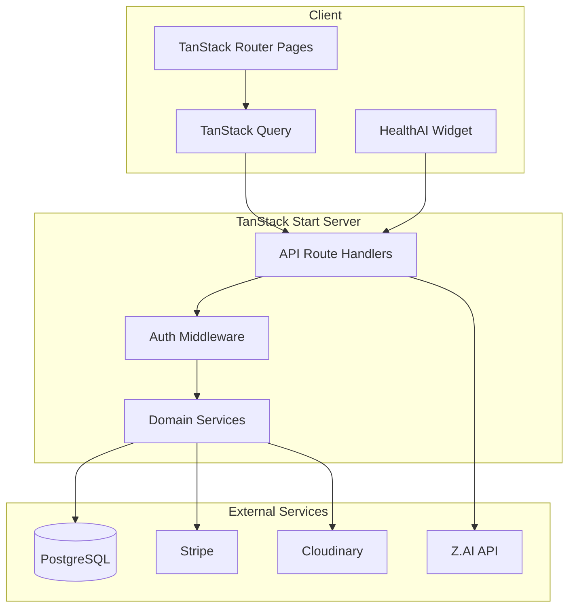

<p align="center">
  
</p>

<p align="center">
  
  
  
  
  
  
</p>

<p align="center">
  
  
  
  
  
  
  
</p>

<p align="center">
  
  
  
  
  
  
  
</p>

<p align="center">
  
  
  
  
  

</p>

<h1 align="center">Smart Health Care — Modern Healthcare Made Simple</h1>

**Full-stack healthcare portal** for doctor discovery, appointment booking, Stripe payments, prescriptions, and role-based dashboards — with an AI health assistant.

[**Live Demo**](https://smarthealthcare-start.netlify.app/) · [Repository](https://github.com/mohamim360/SmartHealthCare-Hospital-Management-System)

---

## The problem & the solution

Healthcare booking and practice management often live in disconnected tools — one site to find a doctor, another to pay, another for admin staff.

**Smart Health Care** brings it together: public discovery and marketing, patient booking with **Stripe Checkout**, doctor scheduling with weekly availability, admin operations for the whole practice, and **HealthAI** for guided navigation and appointment help — all on one platform built with modern full-stack TypeScript.

> Find qualified doctors, let AI book appointments for you or your staff, and manage health records from one trusted platform.

---

## Key features

### Public experience

- **Marketing landing** — live stats, featured doctors, testimonials (`/`)
- **Doctor directory** — search, filters, pagination (`/consultation`)
- **Doctor profiles** — public profile with available schedules (`/doctor/:id`)
- **Auth** — patient registration with optional profile photo upload (`/login`, `/register`)

### Patient dashboard

- **Book appointment** — select doctor → time slot → Stripe Checkout
- **My appointments** — view and manage bookings
- **Payment history** — paid/unpaid status with Stripe verification
- **Prescriptions & health records** — view issued prescriptions
- **Reviews** — rate and review doctors

### Doctor dashboard

- **Appointments** — manage patient visits and status
- **My schedules** — weekly availability, slot generation, day cancellations
- **Prescriptions** — create and manage patient prescriptions

### Admin dashboard

- **Doctors, patients, admins** — full user management with soft delete
- **Appointments & schedules** — practice-wide scheduling
- **Payments** — overview of Stripe transactions
- **Dashboard metadata** — role-specific stats and KPIs

### HealthAI assistant

- Floating chat on landing and dashboard pages
- General health Q&A with rate limiting
- Role-aware deep links into the app
- Optional appointment booking via chat (including admin booking on behalf of patients)

### Platform capabilities

- **Authentication** — JWT access + refresh tokens, bcrypt passwords, HttpOnly cookies + Bearer header, role-based route guards
- **Payments** — Stripe Checkout sessions, success/cancel flows, webhooks, payment verification
- **Media** — Cloudinary uploads for profile photos
- **Architecture** — TanStack Start API routes → domain services → Prisma → PostgreSQL
- **API playground** — interactive endpoint tester at `/dev` (development)

---

## Tech stack

| Category | Technologies |
|----------|--------------|
| **Frontend** | React 19, TanStack Router / Start / Query, Tailwind CSS 4, shadcn/ui, Lucide, Framer Motion, Sonner |
| **Backend** | TanStack Start server handlers, TypeScript domain services, Zod, react-hook-form, date-fns |
| **Database** | PostgreSQL, Prisma 7 (`@prisma/adapter-pg`) |
| **Auth** | Custom JWT (jsonwebtoken) + bcryptjs password hashing |
| **Payments** | Stripe Checkout + webhooks |
| **Media** | Cloudinary |
| **AI** | Z.AI (GLM-4.5) via OpenAI-compatible HTTP API |
| **Deploy** | Netlify (`@netlify/vite-plugin-tanstack-start`) |

> **Note:** Auth uses custom JWT; the assistant uses Z.AI directly.

---

## Architecture



**Request flow:** UI pages and the AI widget call REST-style handlers under `src/routes/api/`. Middleware verifies JWTs; services in `src/lib/` encapsulate business logic and Prisma access.

---

## Project structure

```
smarthealthcare/
├── prisma/
│   ├── schema.prisma          # Data model (User, Doctor, Patient, Appointment, …)
│   ├── migrations/
│   └── seed-doctors.ts        # Demo doctor data
├── docs/
│   └── screenshots/           # README feature images (you add these)
├── src/
│   ├── routes/                # File-based pages + API routes
│   │   ├── index.tsx          # Landing
│   │   ├── consultation.tsx   # Doctor search
│   │   ├── dashboard/         # Patient, doctor, admin dashboards
│   │   └── api/               # REST handlers (auth, appointments, payments, AI, …)
│   ├── lib/                   # Domain services, auth, payment, validators
│   ├── components/            # UI, layout, landing, forms, AI widget
│   ├── hooks/                 # useAuth, useAiChat, useDoctorFilter, …
│   └── generated/prisma/      # Prisma client (generated)
├── netlify.toml               # Production deploy config
├── .env.example               # Environment variable template
└── package.json
```

---

## Getting started

### Prerequisites

- **Node.js** 20+
- **PostgreSQL** database
- **npm** or **bun**

### Installation

```bash
git clone <your-repo-url>
cd smarthealthcare
npm install
```

### Environment

Copy the template and fill in your values:

```bash
cp .env.example .env.local
```

See [`.env.example`](.env.example) for every variable and what it does.

### Database

```bash
npm run db:generate
npm run db:migrate
npm run db:seed:doctors   # optional: demo doctors
```

### Run locally

```bash
npm run dev
```

Open [http://localhost:3000](http://localhost:3000).

For the first admin account, set `ALLOW_BOOTSTRAP=true` temporarily and use `POST /api/user/create-admin`, then disable it.

---

## Scripts

| Command | Description |
|---------|-------------|
| `npm run dev` | Start dev server (port 3000) |
| `npm run build` | Production build |
| `npm run preview` | Preview production build |
| `npm run test` | Run Vitest |
| `npm run lint` | ESLint |
| `npm run format` | Prettier |
| `npm run check` | Format + ESLint fix |
| `npm run db:generate` | Generate Prisma client |
| `npm run db:push` | Push schema to DB (dev) |
| `npm run db:migrate` | Run migrations (dev) |
| `npm run db:studio` | Open Prisma Studio |
| `npm run db:seed` | Run default seed |
| `npm run db:seed:doctors` | Seed demo doctors |

---

## API overview

| Area | Endpoints |
|------|-----------|
| **Auth** | `/api/auth/login`, `logout`, `me` |
| **Users** | `/api/user/create-patient`, `create-doctor`, `create-admin` |
| **Doctors** | `/api/doctor/`, `/:id`, `profile`, `specializations` |
| **Patients** | `/api/patient/`, `/:id`, `profile` |
| **Schedules** | `/api/schedule/`, `/api/doctor-schedule/`, `/api/weekly-availability/` |
| **Appointments** | `/api/appointment/` |
| **Payments** | `/api/payment/checkout`, `verify`, `webhook` |
| **Prescriptions** | `/api/prescription/` |
| **Reviews** | `/api/review/` |
| **Public** | `/api/public/landing-data` |
| **AI** | `/api/ai/chat` |
| **Health** | `/api/health` |

Explore endpoints interactively at **`/dev`** during local development.

---

## Deployment

Production deploys target **Netlify** via [`netlify.toml`](netlify.toml):

1. `npm install`
2. `prisma generate` + `prisma migrate deploy`
3. `vite build`
4. Publish `dist/client`

Set all environment variables from `.env.example` in the Netlify dashboard. Use your production `SITE_URL` for Stripe redirect URLs and configure the Stripe webhook to point at `/api/payment/webhook`.

---

## Data model (high level)

- **Roles:** `PATIENT`, `DOCTOR`, `ADMIN`
- **Core entities:** User, Doctor, Patient, Admin, Schedule, DoctorSchedules, DoctorWeeklyAvailability, Appointment, Payment, Prescription, Review

Full schema: [`prisma/schema.prisma`](prisma/schema.prisma).

---

## Known limitations

- `/forgot-password` is a stub (not implemented)
- Admin **Specialities** UI uses mock data (not DB-backed)
- `videoCallingId` is stored on appointments but there is no video-call UI yet
- Vitest is configured; test files are not yet added

---

Built with [TanStack Start](https://tanstack.com/start).
